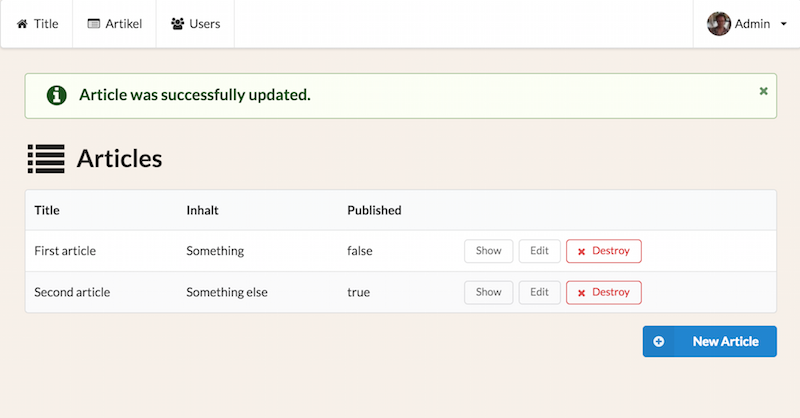
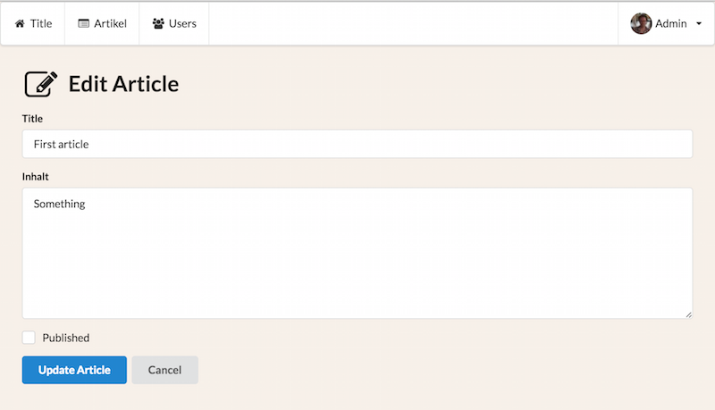

# semantic-rails-ui

[][gem]
[][travis]
[][gemnasium]
[][codeclimate]
[][coveralls]

[gem]: https://rubygems.org/gems/semantic-rails-ui
[travis]: http://travis-ci.org/igorj/semantic-rails-ui
[gemnasium]: https://gemnasium.com/igorj/semantic-rails-ui
[codeclimate]: https://codeclimate.com/github/igorj/semantic-rails-ui
[coveralls]: https://coveralls.io/r/igorj/semantic-rails-ui


- Integration with semantic-ui (with semantic-ui-sass gem) and simple_form.
- The gem also includes coffee-rails, sass-rails, jquery-rails, uglifier and turbolinks, so you don't have to include them in your rails application
- Adds following view helpers: `ui_flash_messages`, `ui_icon`, `ui_icon_header`, `ui_delete_link`
- Modifies the default rails scaffolding templates so that you get nice semantic-ui scaffolds out of the box




## Installation

Add this line to your application's Gemfile:

```ruby
gem 'semantic-rails-ui'
```

And then execute:

    $ bundle


## Usage

Add semantic-rails-ui to your assets: 

application.js
```
//= require semantic-rails-ui
```

application.sass: 
```
@import "semantic-rails-ui"
```

Now you can generate a scaffold and enjoy the semanic-ui look & feel. 

You can also use the provided helpers: 

```
<%= ui_icon_header "Welcome home", "home" %>
```

```
<%= ui_delete_link 'Destroy', article, 'Are you sure?' %>
```

```
<%= ui_flash_messages %>
```


## Development

After checking out the repo, run `bin/setup` to install dependencies. Then, run `rake test` to run the tests. You can also run `bin/console` for an interactive prompt that will allow you to experiment.

To install this gem onto your local machine, run `bundle exec rake install`. 

To release a new version, run `bundle exec rake release_patch`, `bundle exec rake release_minor`, oder `bundle exec rake release_major`, which will create a git tag for the version, push git commits and tags, and push the `.gem` file to https://rubygems.org.

## Contributing

Bug reports and pull requests are welcome on github at https://github.com/igorj/semantic-rails-ui.

## License

The gem is available as open source under the terms of the [MIT License](http://opensource.org/licenses/MIT).
